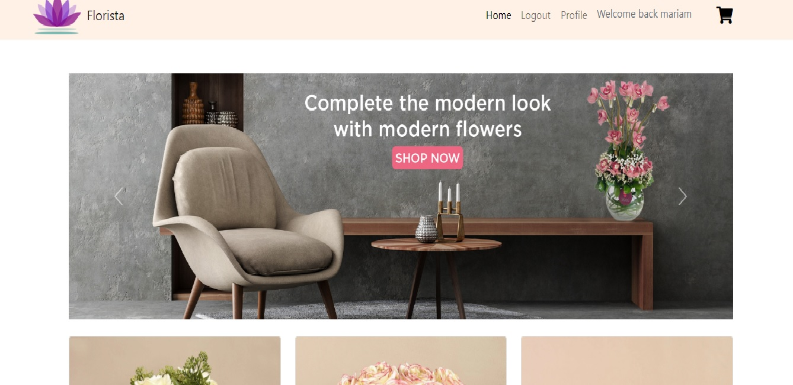
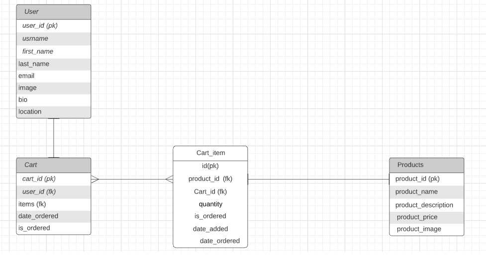
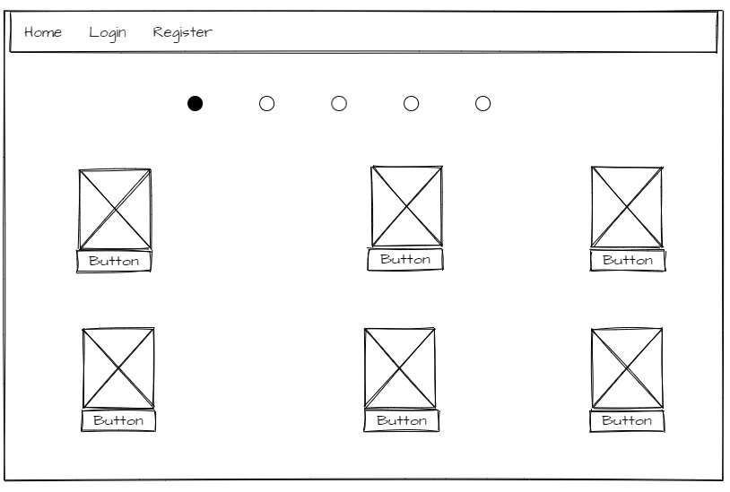

---

## Project Discription

**Florista** It is an E-commerce website that sells flowers of all kinds, where the customer can buy or give some flowers, for example to friends.

## the FLORISTA Website

[ Florista ](#)

**Some screenshot about Florista Website**


## Installation

```sh
#run the commands in this sequence
    $ code florista/settings.py # Now update the 'USER' and 'PASSWORD' values in DATABASES. 
    $ pipenv shell # start workspace
    $ pipenv install #install all dependencies
    $ psql # To Connect to the database, you can use `psql -U postgres`
    `postgres=` CREATE DATABASE flowershop;# To create flowershop
    `postgres=` \q # To quit the database
    $ python manage.py createsuperuser # Creating an admin user. IF it is not work tray `$ winpty python manage.py createsuperuser`
    $ python manage.py makemigrations
    $ python manage.py migrate
    $ python manage.py runserver # start server
```

## Technologies 
* HTML
* CSS (Framework) : Bootstrap
* JavaScript(Library) : jQuery
* Python (Framework) : Django

## Application Architecture

### ERD diagram

An **entity relationship diagram (ERD)** shows the relationships of entity sets stored in a database. An entity in this context is an object, a component of data. An entity set is a collection of similar entities. These entities can have attributes that define its properties.

* The table we have is the **USER** that contains user data, including the user, which is the primary key, which means that it is a unique identifier that is not repeated in any other table.

* The **USER** table is linked to a **_one-to-many_** relationship with the **CART**, the card contains two keys, one is the primary key, which is a **CART_ID**, and the other is a foreign key **USER_ID**, foreign key means is a set of attributes in a table that refers to the primary key of another table.

* **CART** table is related to a **_many-to-many_** relationship with the **CART_ITEMS**, as each item in the card is linked to a **_one-to-one_** relationship in the **PRODUCTS** table.

* **CART_ITEM** as each item in the card is related to a **_one-to-one_** relationship in the **PRODUCTS** table.




### Wireframe
A **wireframe** is a layout of a web page that demonstrates what interface elements will exist on key pages.



### User stories 
* As a user, I want to login/register, so that I can interact with the website.
* As a user, I want to add products to the cart and keep tracking for my orders.
* As a user, I want to have a wish list and be able to add items to my wish list.

## Future Development

* Add dark mode
* Add different categories of gifts and flowers
* Add online payment
 

## Resources

* [Mockflow: used for designing the Wireframe ](https://wireframepro.mockflow.com/)
* [Color palette picker](https://coolors.co/)
* [How to add dark mode to the website](https://pypi.org/project/django-dark/)
* [Reset password with email](https://docs.djangoproject.com/en/3.0/topics/auth/default/#all-authentication-views)